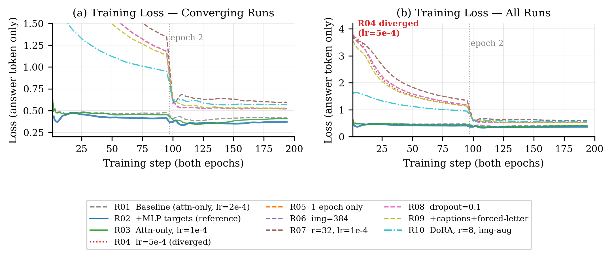
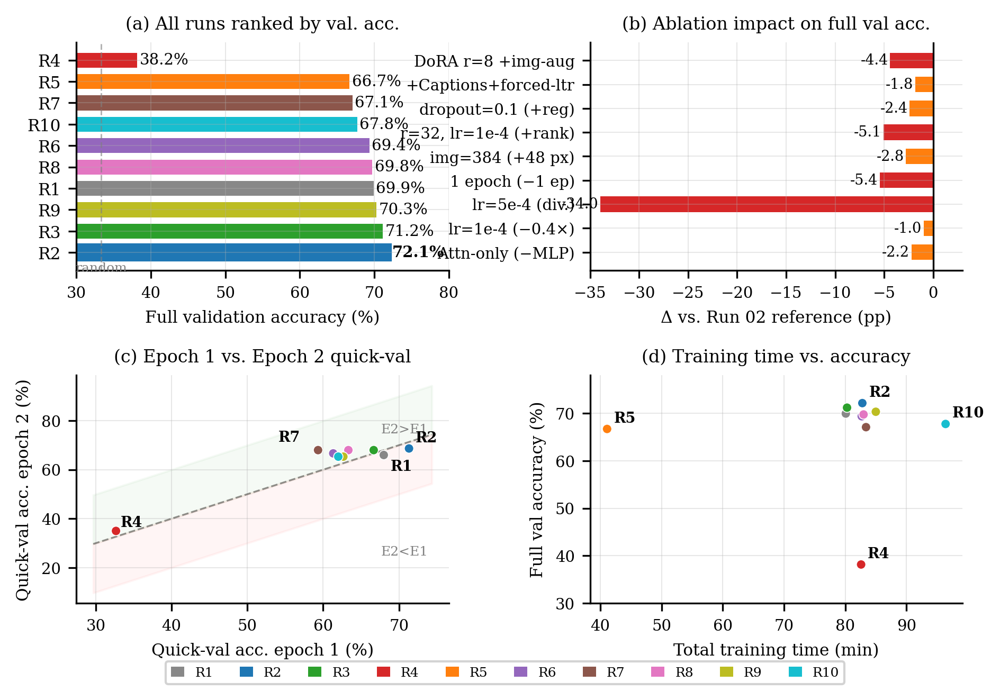
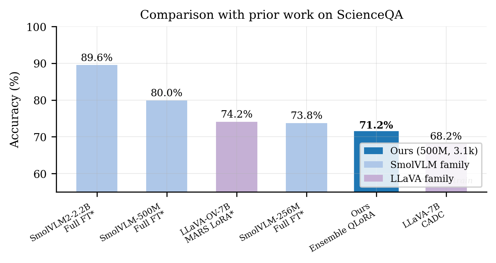

# ScienceQA Vision Challenge

Fine-tuning `HuggingFaceTB/SmolVLM-500M-Instruct` with QLoRA to solve visual multiple-choice science questions (Natural Science, Geography, Biology).

**Competition:** [Pixels to Predictions — Kaggle](https://www.kaggle.com/competitions/pixels-to-predictions)  
**Course:** Deep Learning, NYU (Spring 2025)  
**Best result:** 71.2% test accuracy (ensemble) · 72.1% validation accuracy (single model)

---

## Setup & Quick Start

**Requirements** (all pinned versions used during training):

```bash
pip install -r requirements.txt
```

**To reproduce the best single run (Run 02):**

1. Open `notebook-qlora.ipynb` in Google Colab (A100 GPU recommended).
2. Mount Google Drive — outputs are saved there automatically.
3. Cell 2 is pre-configured with the Run 02 config. Run all cells.
4. Training takes ~82 min; adapter weights (~37 MB) are saved to Drive.
5. Switch runtime to T4/L4, reopen notebook, run Cell 1 → Cell 2 → Cell 5 for inference.

**To reproduce the ensemble submission:**

- Train Run 02 and Run 03 (identical notebooks, different Cell 2 configs from `run_configs.json`).
- Open `notebook-ensemble.ipynb` and point it at both adapter directories.

**Google Drive layout expected by notebooks:**
```
MyDrive/
├── Data/pixels-to-predictions/   ← dataset (train.csv, val.csv, test.csv, images/)
└── scienceqa_runs/               ← adapter weights + results auto-saved here
    └── run_XX/adapter_run_XX/    ← ~37 MB per run (adapter_model.safetensors)
```

**Environment:** Python 3.11, CUDA 12.1, tested on A100 40GB (training) and L4/T4 (inference).

---

## Notebooks

| Notebook | Description |
|----------|-------------|
| [](https://colab.research.google.com/github/salawhaaat/scienceqa-vision-challenge/blob/main/notebook-qlora.ipynb) **[notebook-qlora.ipynb](notebook-qlora.ipynb)** | Main training notebook — Run 02 (best single model, no preprocessing) |
| [](https://colab.research.google.com/github/salawhaaat/scienceqa-vision-challenge/blob/main/notebook-qlora-preprocess.ipynb) **[notebook-qlora-preprocess.ipynb](notebook-qlora-preprocess.ipynb)** | Training with caption preprocessing (Run 09) |
| [](https://colab.research.google.com/github/salawhaaat/scienceqa-vision-challenge/blob/main/notebook-ensemble.ipynb) **[notebook-ensemble.ipynb](notebook-ensemble.ipynb)** | Ensemble inference — averages logits of Run 02 + Run 03 |

---

## Method

| | |
|---|---|
| **Base model** | `HuggingFaceTB/SmolVLM-500M-Instruct` (~512M params) |
| **Fine-tuning** | QLoRA — 4-bit NF4 + double quantization, BF16 compute |
| **LoRA config** | r=16, α=32, dropout=0.05, 7 modules (q/k/v/o + gate/up/down\_proj) |
| **Trainable params** | ~5.1M / 512.6M (0.99%) |
| **Optimizer** | AdamW lr=2e-4, weight\_decay=0.01, cosine LR + 5% warmup |
| **Batch size** | 8 × 4 grad\_accum = 32 effective |
| **Image size** | 336 × 336 (LANCZOS resize + gray pad) |
| **Training GPU** | A100 40GB (Google Colab Pro) ~82 min / run |
| **Inference GPU** | L4 (Google Colab) |
| **Total compute** | ~280–300 Colab units ($30 total — $20 paid + $10 student plan) |

### Key design choices

- **Answer-only loss masking** — only the final answer letter token (A/B/C/D/E) is supervised; all prompt tokens are masked to −100. Without this the model memorizes the template.
- **Backward-search token targeting** — finds the answer position by searching backward from the last real token, robust to image-token interleaving in the attention mask.
- **Gray padding** — aspect-ratio-preserving resize + neutral-gray pad to square, preserving spatial orientation for maps and labeled diagrams.
- **Logit-slice inference** — prediction via argmax over the 5 letter token logits at the last sequence position (no generation needed).

---

## All Runs — Ablation Results

| Run | Key change | Targets | r | LR | Img | QV E1 | QV E2 | Full Val | Test |
|-----|-----------|---------|---|-----|-----|-------|-------|----------|------|
| 01 | Baseline, attn-only | Attn (4) | 16 | 2e-4 | 336 | 68.0% | 66.0% | 69.9% | — |
| **02** | **+MLP targets (reference)** | **Attn+MLP (7)** | **16** | **2e-4** | **336** | **71.3%** | **68.7%** | **72.1%** | **70.8%** |
| 03 | Lower LR, attn-only | Attn (4) | 16 | 1e-4 | 336 | 66.7% | 68.0% | 71.2% | 69.6% |
| 04 | lr=5e-4 (**diverged**) | Attn (4) | 16 | 5e-4 | 336 | 32.7% | 35.0% | 38.2% | — |
| 05 | 1 epoch only | Attn+MLP (7) | 16 | 2e-4 | 336 | 64.0% | — | 66.7% | — |
| 06 | img=384 | Attn+MLP (7) | 16 | 2e-4 | 384 | 61.3% | 66.7% | 69.4% | — |
| 07 | r=32, lr=1e-4 | Attn+MLP (7) | 32 | 1e-4 | 336 | 59.3% | 68.0% | 67.1% | — |
| 08 | dropout=0.1 | Attn+MLP (7) | 16 | 2e-4 | 336 | 63.3% | 68.0% | 69.8% | — |
| 09 | +captions + forced letter | Attn+MLP (7) | 16 | 2e-4 | 336 | 62.7% | 65.3% | 70.3% | 68.8% |
| 10 | DoRA r=8 + img aug | Attn+MLP (7) | 8 | 2e-4 | 336 | — | — | 67.8% | 65.2% |
| **Ensemble 02+03** | avg logits | — | — | — | — | — | — | — | **71.2%** |

QV = quick-val (150 random samples). Full Val = all 1,048 validation examples.

---

## Key Findings

1. **MLP targets matter** — including `gate/up/down_proj` adds **+2.2 pp** over attention-only LoRA at the same lr and rank (Run 02 vs 01). Feed-forward layers encode domain knowledge that needs adapting.
2. **lr=2e-4 is the sweet spot** — lr=5e-4 diverges immediately (loss starts at 3.75, accuracy near random); lr=1e-4 is stable but −0.9 pp slower.
3. **r=16 is optimal for 3.1k samples** — r=32 overfits (−5.0 pp); r=8 via DoRA underfits (−4.4 pp). Rank and dataset size must match.
4. **More image resolution ≠ better** — 384 px hurts −2.7 pp vs 336 px; more visual tokens lengthen sequences without adding signal for science diagrams.
5. **Extra regularization hurts** — dropout=0.1 costs −2.3 pp; the dataset is too small to benefit from stochastic deactivation.
6. **Caption augmentation backfires** — the model already sees the image directly; synthetic captions add noise (−1.8 pp).
7. **Ensemble is free +0.4 pp** — averaging logits of Run 02 + Run 03 (different lr and targets) yields complementary corrections with no additional training.
8. **val→test gap is stable** — 1.3–1.6 pp across all runs; validation set is a reliable proxy and was not overfit during experiment selection.

---

## Comparison with Prior Work

| System | Params | Train N | Acc |
|--------|--------|---------|-----|
| SmolVLM2-2.2B full FT | 2.2B | 12.7k | 89.6% |
| SmolVLM-500M full FT | 500M | 12.7k | 80.0% |
| LLaVA-OV-7B MARS LoRA | 7B | 12.7k | 74.2% |
| SmolVLM-256M full FT | 256M | 12.7k | 73.8% |
| **Ours: ensemble QLoRA** | **500M** | **3.1k** | **71.2%** |
| LLaVA-7B CADC | 7B | 636 | 68.2% |

Our ensemble reaches competitive accuracy using **14× fewer parameters than LLaVA-7B** and **4× less training data** than the other SmolVLM baselines.

---

## Figures

### Training Loss Curves


*Left: converging runs (y-axis zoomed). Right: all runs at full scale — Run 04 (lr=5e-4, red dotted) diverges immediately with loss starting at 3.75. Run 02 (blue) achieves the lowest final loss.*

### Ablation Analysis


*(a) All runs ranked by full validation accuracy. (b) Delta vs. Run 02 reference — red bars mark high-impact degradations (>3 pp). (c) Epoch 1 vs. epoch 2 quick-val scatter — most runs cluster near the diagonal. (d) Training time vs. accuracy — DoRA (Run 10) incurs the highest cost with no benefit.*

### Comparison with Literature


*Our ensemble (dark blue) is competitive with 7B-parameter models despite using 0.99% trainable parameters and 4× less training data.*

---

## Engineering Bugs Fixed

Six bugs were found and fixed during development — any one of them silently destroys accuracy:

| # | Bug | Effect if left unfixed |
|---|-----|----------------------|
| 1 | **Answer-only loss masking missing** — trained on full prompt | Model memorizes template; accuracy near random |
| 2 | **`include_answer=True` during eval** — correct answer leaked | Quick-val inflated; real accuracy invisible |
| 3 | **Image path double-nesting** — `images/images/train/x.png` | Silent gray placeholder images; model never sees real science diagrams |
| 4 | **Answer token position via diff** — breaks with image tokens | Wrong token supervised; masked loss targets wrong position |
| 5 | **Processor loaded from checkpoint dir** — HF validation error | Training crashes or loads wrong tokenizer config |
| 6 | **`torch.cuda.amp` deprecated** — silent float16 fallback on A100 | Precision mismatch; unstable mixed-precision training |

---

## Configs

All 10 run configs are in [`run_configs.json`](run_configs.json). To reproduce a run, paste the corresponding block into Cell 2 of [`notebook-qlora.ipynb`](notebook-qlora.ipynb) and run all cells.

### Reproduced best config (Run 02)

```python
CONFIG = {
    "run_id": "run_02",
    "model_id": "HuggingFaceTB/SmolVLM-500M-Instruct",
    "lora_targets": ["q_proj", "k_proj", "v_proj", "o_proj",
                     "gate_proj", "up_proj", "down_proj"],
    "lora_r": 16,
    "lora_alpha": 32,
    "lora_dropout": 0.05,
    "learning_rate": 2e-4,
    "num_epochs": 2,
    "batch_size": 8,
    "grad_accum": 4,
    "img_size": 336,
    "max_length": 2048,
    "weight_decay": 0.01,
    "warmup_ratio": 0.05,
    "max_grad_norm": 1.0,
    "quick_val_n": 150,
    "seed": 42,
}
```

### Go/no-go decision rules

```
quick_val < 35%  → abort, fix config    (random baseline ≈ 33%)
quick_val ≥ 35%  → run full val
full_val > best  → new best: download adapter + submit
full_val ≤ best  → discard, next config
```

---

## Repository Structure

```
scienceqa-vision-challenge/
├── notebook-qlora.ipynb            # Main training notebook (Run 02 config)
│   ├── Cell 1 · Setup              # pip install + Drive mount
│   ├── Cell 2 · Config             # paste run block from run_configs.json
│   ├── Cell 3 · Train              # QLoRA fine-tuning loop with quick-val
│   ├── Cell 4 · Full Val + Save    # full 1,048-example eval + adapter save
│   ├── Cell 5 · Inference          # generates submission_runXX.csv on T4/L4
│   └── Cell 6 · Aggregate Chart    # reads all results_*.json, draws comparison
├── notebook-qlora-preprocess.ipynb # Run 09 — adds Cell 2.5 caption preprocessing
├── notebook-ensemble.ipynb         # Ensemble inference (Run 02 + Run 03 logits)
├── run_configs.json                # All 10 run configs as JSON blocks
├── requirements.txt                # Pinned dependency versions
├── figures/                        # Publication-quality result plots
│   ├── fig1_loss_curves.png        # Training loss across all runs
│   ├── fig2_ablations.png          # 4-panel ablation analysis
│   └── fig3_comparison.png         # Comparison with prior work
└── README.md
```

---

## Output Format and Evaluation Metric

**Submission CSV** (one per run, generated by Cell 5):
```
id,answer
test_00001,2
test_00002,0
...
```
`id` matches the test CSV; `answer` is a 0-indexed integer (0=A, 1=B, 2=C, 3=D, 4=E).

**Evaluation metric:** accuracy — fraction of test examples where the predicted answer
index matches the ground-truth index. Random baseline ≈ 33% (3–5 choices per question).
The Kaggle leaderboard computes this on 1,008 held-out test examples.

**Results JSON** (auto-saved per run to Drive):
```
results_run_XX.json
├── config          — full hyperparameter dict
├── epoch_log       — per-epoch loss, quick_val accuracy, lr, wall time
├── full_val_acc    — scalar (e.g. 0.7214)
├── kaggle_test_score — scalar if submitted, else null
└── chart_data      — step_losses, epoch_accs, epoch_lrs (for plotting)
```

---

## Dataset

**Pixels to Predictions** — curated split of [ScienceQA](https://scienceqa.github.io):

| Split | Examples | Images |
|-------|----------|--------|
| Train | 3,109 | ✓ |
| Val | 1,048 | ✓ |
| Test | 1,008 | ✓ (labels withheld) |

Each row: `id, image_path, question, choices (JSON list), num_choices, hint, lecture, grade, subject, ...`  
Answer column present in train/val only (0-indexed integer).

Each example: image + question + 2–5 choices + optional hint/lecture. Subjects: natural science, geography, biology across elementary–middle school grades.

---

## Acknowledgements

Claude (Anthropic) was used for debugging, code generation, and report writing assistance.
